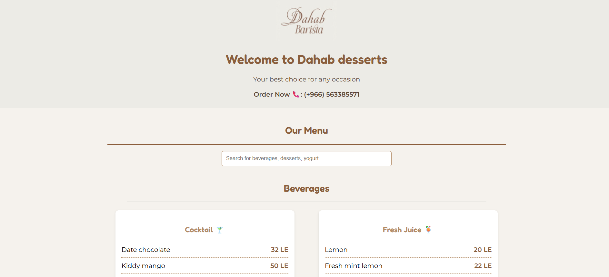
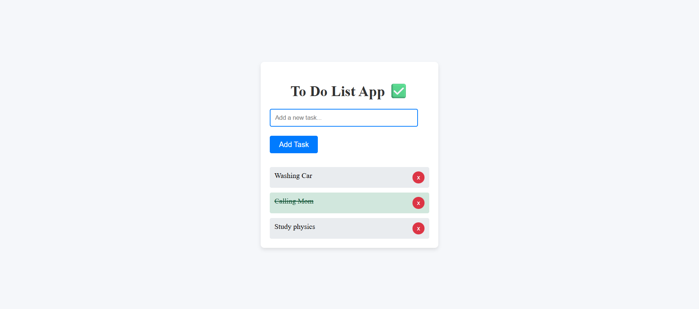
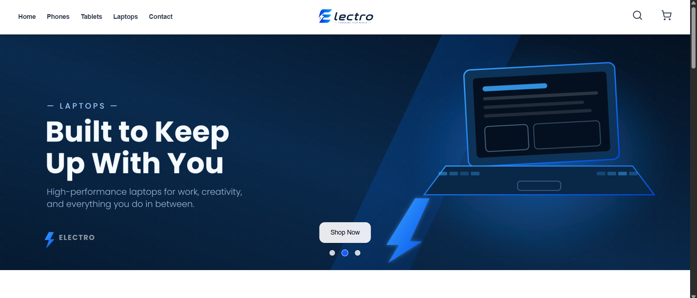
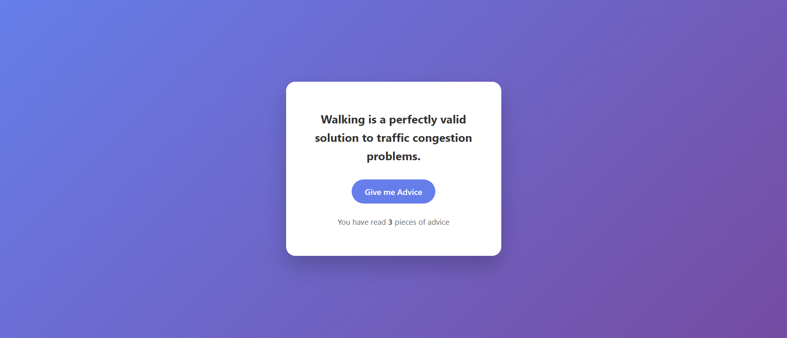

# Ahmed Ashraf — Developer Portfolio


A responsive, single-page developer portfolio presenting Ahmed Ashraf's projects, technical skills, background, milestones, and contact details. The site is built without a framework or build step and includes theme persistence, responsive navigation, adaptive project visibility, and a mail-client contact workflow.

## Live Demo

> **Coming soon:** https://ahm2010.github.io/portfolio/

Individual project demos are linked from their cards on the portfolio.

## Screenshots

No full-page portfolio screenshots are currently included. The repository contains the project preview images used by the portfolio cards:

| Dahab Menu                                                    | To-Do List                                                        |
| ------------------------------------------------------------- | ----------------------------------------------------------------- |
|  |  |

| Electro E-commerce                                                     | Advice Me                                                   |
| ---------------------------------------------------------------------- | ----------------------------------------------------------- |
|  |  |

## Features

- Single-page portfolio with Hero, Projects, Skills, About, Milestones, Contact, and Footer sections
- Four project cards with screenshots, technology tags, descriptions, and live-demo links
- Light, dark, and system-aware theme modes saved in `localStorage`
- Sticky, translucent navigation with smooth anchor scrolling
- Collapsible mobile navigation for smaller screens
- Responsive project, skill, about, and contact layouts
- Adaptive **Show more / Show less** project control based on viewport width
- Contact form validation and prefilled `mailto:` handoff
- Page-load animation, card interactions, and automatic footer year

## Tech Stack

| Area          | Technology                                            |
| ------------- | ----------------------------------------------------- |
| Structure     | Semantic HTML5                                        |
| Styling       | CSS3, custom properties, Flexbox, Grid, media queries |
| Interactivity | Vanilla JavaScript (ES6+, DOM APIs, Web Storage API)  |
| Typography    | Google Fonts — Playfair Display                       |
| Icons         | Bootstrap Icons, Font Awesome                         |
| Tooling       | None required; the site runs as static files          |

## Project Structure

```text
1.2-Portfolio/
├── images/
│   ├── advice-me-screen.png
│   ├── dahab-menu-screen.png
│   ├── electro-app-screen.png
│   ├── laptop-with-code-on-screen.jpg
│   ├── logo.jpeg
│   └── to-do-list-app-screen.png
├── index.html        # Page content and section structure
├── main.js           # Theme, navigation, projects, form, and UI behavior
├── styles.css        # Theme tokens, layout, components, and breakpoints
└── README.md         # Project documentation
```

## Installation

No dependencies or build tools are required.

```bash
git clone https://github.com/AHM2010/portfolio.git
cd portfolio
```

Open `index.html` directly in a browser, or serve the folder with any static file server. For example, if Python is installed:

```bash
python -m http.server 8000
```

Then visit `http://localhost:8000`.

## Available Scripts

This project has no `package.json`; therefore, it does not define `npm run dev`, `npm run build`, or `npm run preview` scripts. It is served directly as a static website and requires no compilation.

## Usage

1. Use the header links or call-to-action buttons to move between page sections.
2. Select the theme button to cycle through light, dark, and automatic themes.
3. Use **Show more** to reveal project cards hidden by the responsive initial limit.
4. Follow a project's **Live Demo** link to view the deployed application.
5. Complete the contact form to open the default email client with a prepared message.

## Responsive Design

The layout uses CSS Grid, Flexbox, fluid spacing, and breakpoints at `1100px`, `1000px`, `900px`, `820px`, `680px`, `640px`, `600px`, and `500px`. Project cards move from three columns to two and then one; navigation switches to a mobile panel; and the hero, skills, about, and contact layouts adapt independently to available space.

## Key Implemented Features

### Theme management

The theme control cycles through `light`, `dark`, and `auto`. The selected value is applied through the root `data-theme` attribute and persisted under the `ahmed-theme` key in `localStorage`. CSS custom properties provide consistent colors across modes.

### Adaptive project display

JavaScript calculates the initial number of visible projects from the viewport: three at widths of at least `1000px`, otherwise two. The control label reflects the number of hidden projects, and visibility is recalculated on resize.

### Contact workflow

Native HTML constraints validate name, email, and message fields. Submission is handled in the browser and opens a `mailto:` URL containing the entered details; no user data is sent to or stored by a backend.

## State Management

State is intentionally lightweight and local to `main.js`:

- `currentTheme` tracks the active theme and persists it with the Web Storage API.
- `projectsExpanded` tracks whether all project cards are visible.
- The mobile menu's open state is represented by the `.open` CSS class.

No external state-management library or server-side state is used.

## Routing Structure

The site has no client-side routing library. Navigation uses in-page fragment links and matching section IDs:

| Route       | Section                  |
| ----------- | ------------------------ |
| `#projects` | Selected project work    |
| `#skills`   | Skills and tools         |
| `#about`    | Biography and milestones |
| `#contact`  | Contact form and details |

The hero is available at `#hero`, while the document root displays the complete page.

## Performance and UX

- Zero application dependencies and no JavaScript bundle or compilation step
- Local project imagery with `object-fit` for stable card presentation
- CSS custom properties reduce duplicated theme styles
- Responsive content density keeps project grids readable across devices
- Sticky navigation and smooth scrolling improve movement through the page
- Subtle load, hover, and focus feedback supports orientation without heavy animation
- External font and icon origins use CDN delivery; Google Fonts origins are preconnected

## Accessibility Considerations

- The document declares its language and includes a responsive viewport setting.
- Content uses semantic landmarks such as `header`, `nav`, `main`, `section`, `article`, and `footer`.
- Images include alternative text.
- Icon-only navigation controls include accessible labels and titles.
- Form fields use native input types, required constraints, length limits, and a name pattern.
- Inputs and textareas receive visible focus outlines.
- Theme colors are centralized, making contrast adjustments straightforward.

Further accessibility testing is still recommended, particularly keyboard behavior for the mobile menu, explicit form labels, focus visibility on all interactive elements, and reduced-motion preferences.

## Future Improvements

- Deploy the portfolio and add its public URL
- Add full-page desktop and mobile screenshots
- Add explicit `<label>` elements and status feedback to the contact form
- Expose expanded/collapsed states through `aria-expanded` on interactive controls
- Add `prefers-reduced-motion` styles for animations and smooth scrolling
- Add automated HTML, accessibility, and cross-browser checks
- Optimize responsive image delivery and lazy-load below-the-fold images

## Author

**Ahmed Ashraf** — Web Developer and Student

- [GitHub](https://github.com/AHM2010)
- [LinkedIn](https://www.linkedin.com/in/ahmed-ashraf-491132353/)

## License

No license file is currently included. Unless a license is added, the source code remains under the author's default copyright and is not automatically licensed for reuse or redistribution.
