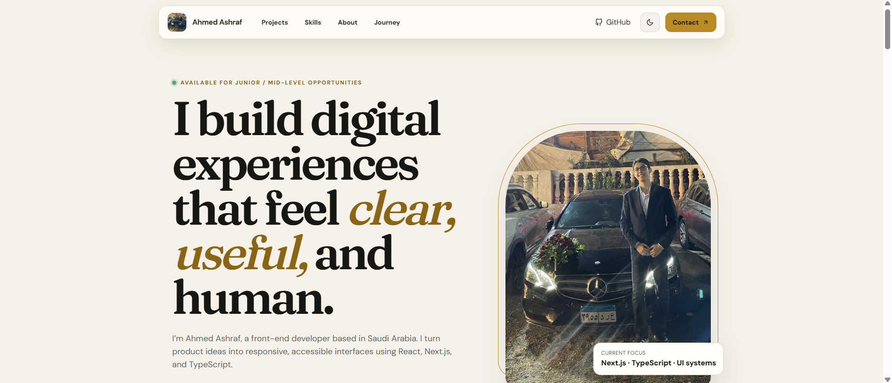
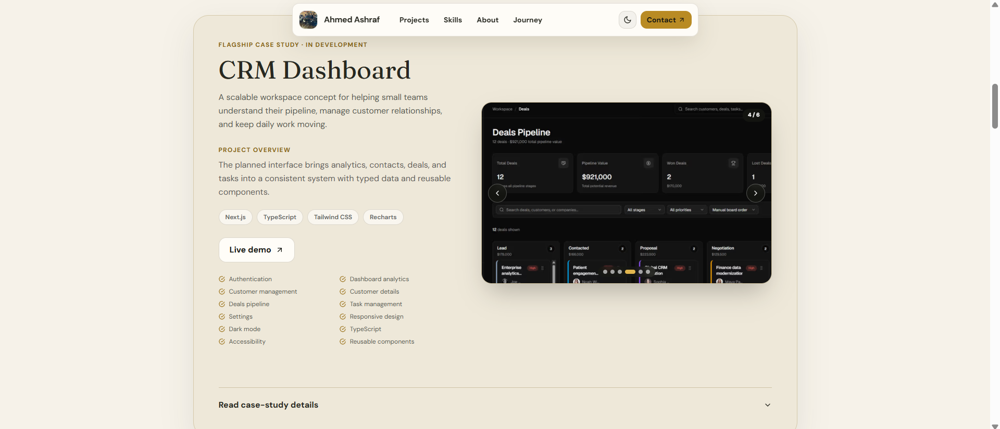
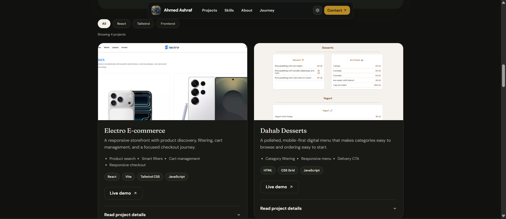
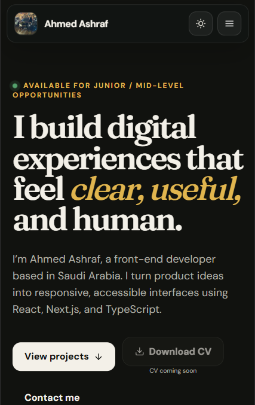

# Ahmed Ashraf — Front-End Developer Portfolio

A responsive, accessible portfolio for presenting my front-end work, technical skills, learning journey, and contact information.

[View the live portfolio](https://ahmed-portfolio-mu-lovat.vercel.app/)

## Preview

<p align="center">
  
</p>

| Nexora CRM showcase                                                                                                 | Projects in dark mode                                                                                   |
| ------------------------------------------------------------------------------------------------------------------- | ------------------------------------------------------------------------------------------------------- |
|  |  |

<p align="center">
  
</p>

## Highlights

- Responsive layout designed for desktop, tablet, and mobile
- Light and dark themes with persisted user preference
- Sticky navbar that smoothly contracts while scrolling
- Animated availability indicator and section reveal effects
- Filterable project collection
- Reusable project image gallery with:
  - Automatic single-image or carousel rendering
  - Infinite previous and next navigation
  - Pagination dots and image counter
  - Touch swipe and keyboard arrow support
  - Optional autoplay that pauses during interaction
  - Hover-revealed controls on pointer devices
  - Loading placeholders and image fade-in effects
  - Reduced-motion support
- Expandable project and CRM case-study details
- Dedicated Nexora CRM showcase with a live demo and multi-image gallery
- Accessible focus states, descriptive image text, and skip navigation
- SEO metadata, Open Graph images, sitemap, and robots configuration

## Featured Projects

### Nexora CRM

A responsive CRM workspace with dashboard analytics, customer management, customer details, a deals pipeline, task management, settings, and dark mode.

[Open the Nexora CRM demo](https://nexora-crm-one.vercel.app/)

### Electro E-commerce

A responsive storefront with product discovery, filtering, product details, cart management, and a focused checkout flow.

### Dahab Desserts

A polished, mobile-first digital menu with category browsing, search, and direct ordering actions.

### Task List

A focused browser-based task manager with local progress persistence.

### Advice Me

A lightweight React application that retrieves and presents advice through a clean interface.

## Technology

- Next.js App Router
- React
- TypeScript
- Tailwind CSS
- Framer Motion
- React Icons
- Next.js Image optimization

## Project Structure

```text
app/          Routes, metadata, and global styles
components/   Reusable interface and animation components
data/         Project, skill, timeline, and social-link data
public/       Portfolio images and project screenshots
types/        Shared TypeScript types
```

Project screenshots are defined as objects containing their source and meaningful alternative text:

```ts
images: [
  {
    src: "/screenshots/project-dashboard.png",
    alt: "Project analytics dashboard",
  },
];
```

The shared gallery displays a standard image for one entry and enables the complete carousel experience when two or more entries are provided.

## Local Development

Requirements:

- Node.js 20 or newer
- npm

Install dependencies and start the development server:

```bash
npm install
npm run dev
```

Open [http://localhost:3000](http://localhost:3000).

## Available Scripts

```bash
npm run dev
npm run lint
npm run build
npm run start
```

## Environment

Set the production origin before deploying:

```env
NEXT_PUBLIC_SITE_URL=https://your-domain.example
```

This value is used for canonical URLs, sitemap metadata, and social sharing metadata.

## Quality Checks

Before deployment, run:

```bash
npm run lint
npm run build
```
